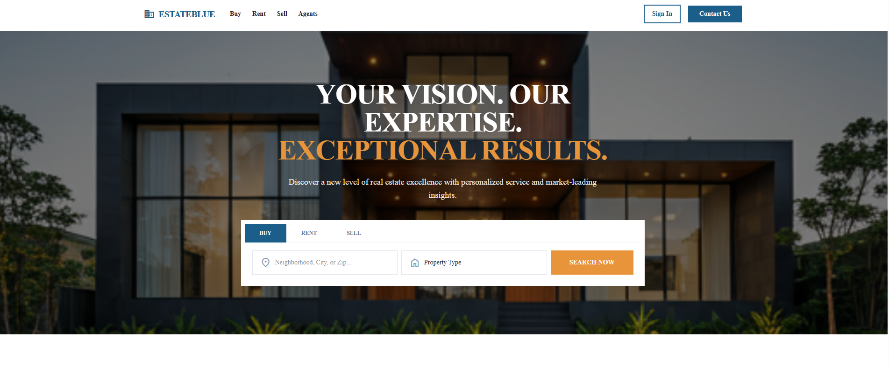
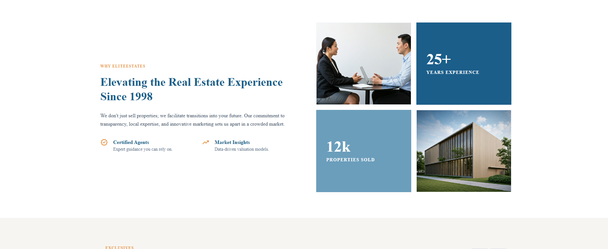
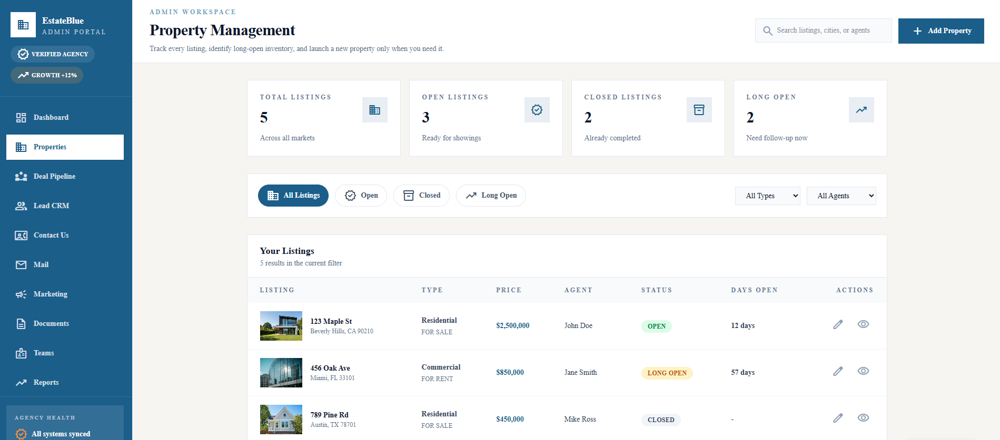
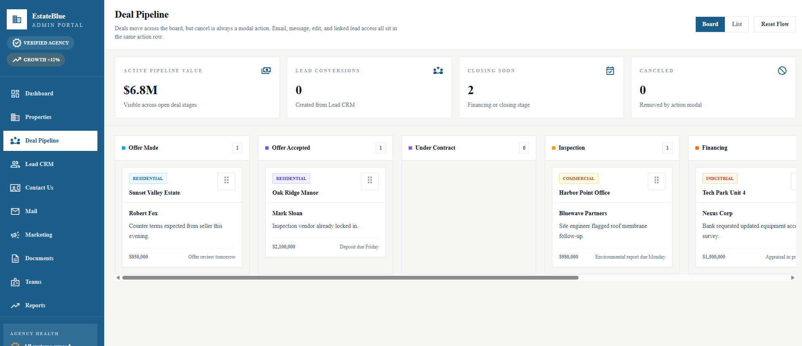

# Real Estate Management Platform

## 🚧 Under Construction

> **⚠️ This project is currently under development.** Features, documentation, and codebase are actively being built and may change.

---

## About This Project

This is a comprehensive **Real Estate Management Platform** designed specifically for **individual brokers and agencies** to manage properties for **sell** and **rent**. The platform provides a complete solution for real estate professionals to streamline their operations, manage leads, track deals, and showcase properties to potential buyers and renters.

### Who Is This For?

- **Individual Real Estate Agents** – Solo professionals managing their own property portfolio
- **Real Estate Agencies** – Teams of agents working together under an agency
- **Property Managers** – Professionals handling multiple properties for clients
- **Brokers** – Managing both sales and rental properties

---

## Key Features

### 🏠 Property Management

- List properties for **sale** and **rent**
- Advanced property search and filtering
- Property details with images, descriptions, and specifications
- Neighborhood information and market insights

### 👥 User Roles & Access

- **Admin/Agency** – Full control over agency settings, team management, and all properties
- **Agent** – Manage personal properties, leads, and deals
- **Buyer** – Browse properties, create wishlists, schedule viewings
- **Seller** – List properties for sale or rent

### 📊 Deal Pipeline & CRM

- Lead management and tracking
- Deal pipeline visualization
- Contact inbox for client communications
- Mail integration for follow-ups

### 📈 Reports & Analytics

- Deal pipeline reports
- Performance analytics
- Marketing campaign insights

### 📁 Document Management

- Store and manage property documents
- Template management for contracts and agreements

### 📣 Marketing Tools

- Campaign management
- Market insights and blog content

---

## Project Screenshots

### Homepage



### Real Estate Section



### Neighborhoods


### Admin Dashboard



### Deal Pipeline



---

## Tech Stack

| Category             | Technology               |
| -------------------- | ------------------------ |
| **Framework**        | Next.js 14+ (App Router) |
| **Language**         | TypeScript               |
| **Styling**          | Tailwind CSS             |
| **UI Components**    | Shadcn UI                |
| **Icons**            | Lucide React             |
| **Charts**           | Recharts                 |
| **State Management** | React Hooks              |

---

## Getting Started

### Prerequisites

- Node.js 18+
- npm or yarn

### Installation

```bash
# Navigate to frontend directory
cd frontend

# Install dependencies
npm install

# Run development server
npm run dev
```

The application will be available at `http://localhost:3000`

---

## Project Structure

```
frontend/
├── app/                    # Next.js App Router pages
│   ├── admin/             # Admin dashboard & management
│   ├── agent/             # Agent portal
│   ├── agents/            # Public agents page
│   ├── properties/        # Property listings
│   ├── profile/          # User profiles (buyer/seller)
│   └── ...
├── components/
│   ├── stitch/           # Page components
│   │   └── pages/        # Individual page components
│   └── ui/               # Reusable UI components
├── public/               # Static assets
└── static-data/          # Static configuration data
```

---

## Roadmap

- [ ] Complete property management features
- [ ] Implement user authentication
- [ ] Add database integration
- [ ] Build mobile-responsive views
- [ ] Integrate payment processing for property transactions
- [ ] Add email/SMS notifications
- [ ] Implement advanced search with AI recommendations

---

## Contributing

This project is under active development. For contributions or inquiries, please contact the development team.

---

## Contact

For questions, suggestions, or business inquiries, please reach out through the contact form on the website or email the development team.

---

## License

This project is proprietary software. All rights reserved.

---

_Last updated: March 2026_
